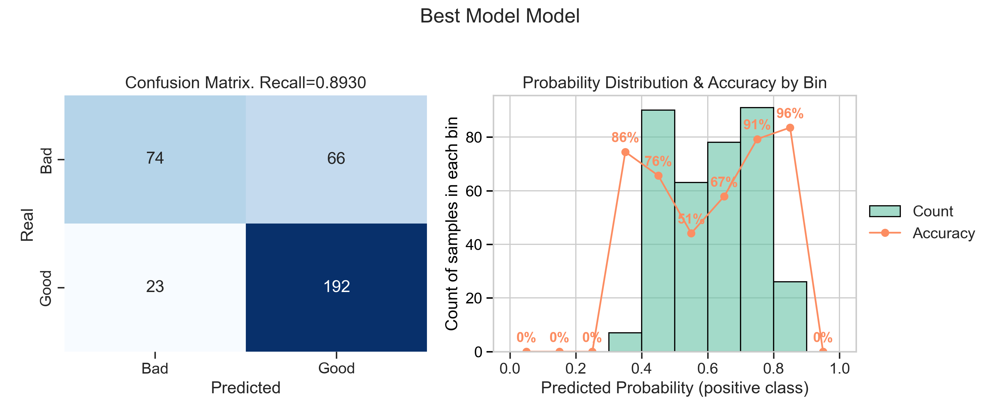
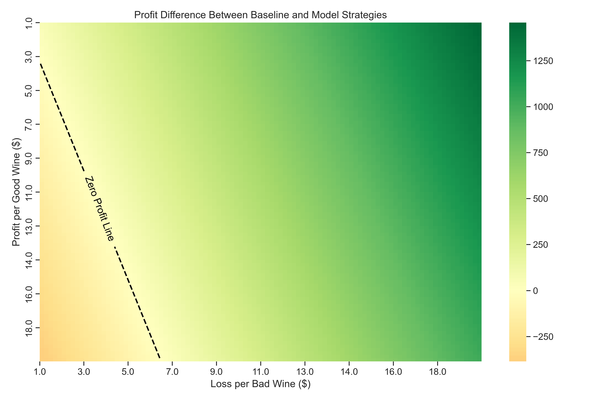

# 🍷 Wine Quality Classifier - Profit-Oriented Wine Selection

## 📘 Project Overview

In the competitive world of wine sales, selecting **high-quality wines** is essential to maximize customer satisfaction and profit margins. This project builds a machine learning model to help businesses **identify wines worth selling**, using only their **physicochemical properties**—saving time and reducing reliance on expensive sensory testing.

The project explores wine data from the [UCI Machine Learning Repository](https://archive.ics.uci.edu/dataset/186/wine+quality), containing red and white wine samples from the **Vinho Verde** region of Portugal. Each sample is associated with a **quality score** (0 to 10) determined by wine experts.

## 💼 Business Scenario

The key business question we aim to answer is:

> "Given the attributes of a wine sample, should we include it in our product line?"

To align with business decision-making, we redefined the target variable as follows:

- **Good wines**: quality ≥ 6  
- **Bad wines**: quality < 6  

This binary classification approach improves class balance and aligns better with the goal of selecting products with potential for higher customer satisfaction and profitability.

## ⚙️ Project Structure

- `data/`: Contains the raw dataset used for modeling.
- `images/`: Includes visual outputs such as performance metrics and profit simulation.
- `notebook/`: Jupyter notebooks for EDA (Exploratory Data Analysis), preprocessing, modeling, and simulation.

## 🧠 Model Objective

The objective is to develop a classifier that can **predict whether a wine is good or bad**, and simulate the **financial implications** of deploying this model in a real-world wine selection process.

We prioritized **minimizing false negatives** (i.e., good wines incorrectly classified as bad), which could result in lost revenue opportunities. To handle this, we optimized for **F2-score**, placing more weight on recall.

## 📊 Results

### 🔍 Section Highlights:

- The **correlation values** between features and the wine quality score were generally low, indicating that a **linear model would be a poor fit**.
- **Recasting the target variable** into two categories—**Good** (quality ≥ 6) and **Bad** (quality < 6)—improved interpretability and business relevance.
- **Pairwise scatterplots** revealed some separation between good and bad wines based on feature combinations.
- The **Kruskal-Wallis test** showed statistically significant differences (at the 5% level) in most features across the two wine classes.
- Notably:
  - `residual_sugar` showed **no statistical difference** in means (p > 5%) and **very low correlation**.
  - `pH` and `sulphates` had **moderate p-values (~3%)** but also **low correlation** with the target.

### ✂️ Feature Selection:

Based on the analysis above, the following features were **dropped** from the final model due to low relevance:

- `residual_sugar`  
- `pH`  
- `sulphates`

This helped streamline the model and reduce noise in training.

---

### 🏆 Model Performance

- The **best-performing model** was built using an **XGBoost classifier**, selected via **RandomizedSearchCV**.
- The hyperparameter tuning process was guided by the **Fβ-score**, with **β = 2** to reflect the business goal:  
  > _A false negative (missing a good wine) is more costly than a false positive (selecting a mediocre one)._
- The **final model** achieved a **recall score of 0.8930**, meaning it was highly effective at identifying good wines.

---

### 📌 Confusion Matrix

The confusion matrix below shows the balance between true positives, false negatives, and other classification outcomes for the best model:

---

### 💰 Profit Simulation

To assess real-world applicability, we simulated the **financial impact** of using this model versus a random baseline. The plot below shows profit differences across different cost/reward settings:

- The **black dashed line** indicates the zero-profit threshold.
- **Green areas** represent scenarios where the model outperforms the baseline in net profit.
- This confirms that the model can be deployed as a **profitable decision-making tool** for wine selection.

---

## ✅ Conclusion

The model successfully identifies wines worth selling and offers **profit-driven insights** into how machine learning can assist in decision-making for the wine industry. With careful tuning and business-driven evaluation metrics, the classifier provides a scalable and cost-effective strategy for wine selection.